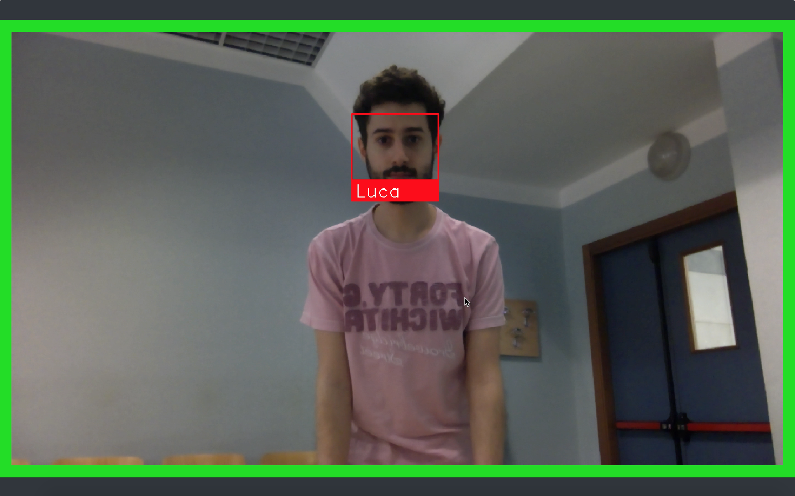

# Micchinetta

## Assignment
Deploy an application interface using both face and speech recognition to achieve a transaction between the user and a vending machine. 
With a webcam, the system should recognize known people. After the recognition, the application must start a conversation-like dialogue with the user:
- **Micchinetta**: Good morning Andy, what do you need?
- **Andy**: I would like three beers and a box of chips, thank you.
- **Micchinetta**: Ok, it's three beers and a box of chips for € 3,80. Ok?
- **Andy**: Ok!

## Goals
1. Recognize people from a set of known faces
2. Sustain a simple conversation with the user to understand his needs
3. Use existing web API, provided by MICC, for transactions and accountability

## Technologies
- The interface is developed with the PyQT Framework using Python.
- Face recognition makes use of a [Python package](https://github.com/ageitgey/face_recognition) and OpenCV for some elaborations and tasks.
- Speech recognition uses a [library](https://pypi.python.org/pypi/SpeechRecognition/) based on Google Cloud APIs.
- The app, to be able to speak, will use this other [Python package](https://pypi.python.org/pypi/pyttsx).
- The Identities along with the face descriptors are maintained in an SQLite database

The system must be connected to the internet to be able to use Google APIs and internal MICC APIs for accountability.
Moreover, the software, to run a simple conversation, will need some capabilities in natural language processing. Many NLP software packages exist, but not many support Italian language along the English language. [TreeTagger](http://www.cis.uni-muenchen.de/~schmid/tools/TreeTagger/) is the software chosen.

All of these software components have a significant computational cost and will require a decent machine to run on.

## Interface and Description
To provide a visual feedback to the user, the system implements a simple interface.

The user will find the application in recognition state, with the interface showing a live view of the scene. Approaching the device, the user will appear on the screen and the recognition will start.

If recognized (matched with one of the known faces) the system gives a visual feedback of the successful recognition:

If multiple faces are present int the scene, the closest (biggest) one is used for identity recognition.

The application will then change state, entering the conversation state represented below:

As soon as the user is recognized, his reference image from the database will be showed along the matched identity and the conversation shall begin. If the identity matched is wrong, the user can tell the system during the conversation and the system will apologize and retry the recognition.

While speaking, the conversation and the “bill” will be displayed and updated.
If the user agrees to the final bill, the machine will commit the transaction and will change its state to idle.

----------------

Along the main app, an other utility app has been developed to help this system admins to manage the Faces database.
The script `DatabaseManager.py` starts this graphical application that allows to add, remove and modify users identities (and the credentials for the Transactions APIs). Face images can be added with drag and drop or using the webcam to capture the face of the new user.

## Usability Tests
The scenario of these tests is a well known and restricted context: the MICC laboratory.
However the usefulness of this system transcends from this and the results obtained are valid also in other similar scenarios.

### Environment and tasks
We placed our system right by the vending machine at MICC, providing it an Internet connection (not really reliable that particular day due to works in progress) and installing all necessary software. We gathered all available staff, in couples or alone, and we presented them with a list of tasks, briefly explaining the application purpose and context.
	
The tasks that users had to perform are:
- To be recognized: Present yourself in front of the machine and let it recognize you.
- Wrong recognition: Simulate a wrong recognition and explain it to the system. 
- Ask for a product: You are hungry or thirsty, so you ask for a product.
- Ask for more products: You are very hungry or thirsty, so you ask for more than one product at once.
- Remove a product: You changed your mind, remove a single product.
- Remove more products: You changed your mind, remove many products.
- Confirm the purchase: You are finished, agree to the transaction.

After completing the tasks, we asked the users to compile a Google Form structured as a SEQ (Single Ease Question) with a 7-point rating scale:
1. I found the reply time too high.
2. I prefer using the mobile application instead of this system.
3. It is hard to use it.
4. The facial recognition works correctly.
5. The Graphic interface is pleasant.
6. I can trust the system.
7. MICChinetta can understand my request.
8. MICChinetta’s replys are wrong.

Moreover we provided the users the chance to express some optional comments for each question.

### Results
*Error trials*: We gathered 13 users, each tried 7 task, so the total amount of trials is 91. Just 12 of these tasks failed, but only 2 resulted in a critical failure due to the lack of connection to Internet, the other 10 where due to fails in speech-recognition and where recovered just by repeating the request.

Figure 10 shows that user's opinions vary when asked if the latency between MICChinetta's replies are too high. This may be linked to the fact that the reply time varies with respect to Internet connection.
Some users however, acknowledge the computational efficiency required for speech recognition and pos-tagging, so their replies are biased. 

Figure 11 shows that the majority of users prefers to use the VUI instead of the mobile App.

Figure 12 shows that most of the users found the system to be self explanatory, this is indeed crucial using a never-seen application. Moreover users agree about the pleasantness of the Graphical Interface demonstrated in Figure 13.

Figure 14 affirms that face recognition was definitely working, this is a factor in the trust placed by the user, reported in Figure 15, and confirmed in the next figures.

We discovered that users ask for products in many different ways: someone makes a robot-like list of products, while others use more complex sentences, like in a conversation at the grocery store. In both these cases, MICChinetta behaved greatly.

Figure 16 and Figure 17 are a good demonstrations of the conversation skills of the system; it can understand what users ask and answers accordingly.

## Conclusion
We presented MICChinetta, a VUI-GUI based system that provides assistance in the process of purchasing snacks and drinks at a vending machine. Systems like this are growing fast in popularity for the most various scenarios, like car driving, mobile phones and many more.
	
We demonstrated the useful functionality of being able to identify users using face recognition and the effectiveness of vocal interactions with an automated system. We discovered the possibilities for augmenting human-computer interactions provided by a prototype like MICChinetta, showing pros and cons of this new approach.
	
A downside was found in a substantial latency in the responses of the system, but being this a study and a prototype, this problem could and will be solved in future releases, maybe using better machines for carrying out all the computation in local, like speech-to-text, without relying over Internet connection.
	
Our final study confirmed that MICChinetta, but more in general VUIs, can do almost everything a GUI can do, not reducing tasks times, but giving the users different possibilities and experiences without using arms or hands.
	
We believe that pushing ourselves in this direction and improving these technologies, they will efficiently substitute standard interfaces where less and less interaction and effort from humans is required.

## Requirements
| Software                                                    | Version        | Required |
| ------------------------------------------------------------|:--------------:| --------:|
| **Python**                                                  |     >= 3.5     |    Yes   |
| **Qt**                                                      |    >= 5.9.1    |    Yes   |
| **PyQt5** (Python Package)                                  |    >= 5.9.1    |    Yes   |
| **Numpy** (Python Package)                                  |Tested on v1.13 |    Yes   |
| **Scipy** (Python Package)                                  |Tested on v1.0.0|    Yes   |
| **TreeTagger**                                              |Tested on v1.0.1|    Yes   |
| **SpeechRecognition** (Python Package)                      |Tested on v3.8.1|    Yes   |
| **PyAudio** (Python Package)                               |Tested on v0.2.11|    Yes   |
| **playsound** (Python Package)                              |    >= 1.2.2    |    Yes   |
| **editdistance** (Python Package)                           |     >= 0.4     |    Yes   |
| **pyobjc** (Python Package only for MacOS)                  |    >= 4.1      |    Yes   |
| [**portaudio**](http://www.portaudio.com)                  |Tested on v19.6.0|    Yes   |
| **pyttsx3** (Python Package)                                |     >= 2.7     |    Yes   |
| **SQLite**                                                  |      >= 3      |    Yes   |
| **OpenCV**                                                  |    >= 3.3.1    |    Yes   |
| [**Face Recognition**](https://github.com/ageitgey/face_recognition) (Python Package)|      >= 3      |    Yes   |
| QDarkStylesheet (Python Package)                            |    >= 2.3.1    | Optional |

QDarkStylesheet was used for a better looking GUI (highly recommended) and can be found in [this GitHub Repo](https://github.com/ColinDuquesnoy/QDarkStyleSheet)

# Developed by [Luca Angioloni](https://github.com/LucaAngioloni/) and [Francesco Pegoraro](https://github.com/SqrtPapere)

## License
Licensed under the term of [MIT License](http://en.wikipedia.org/wiki/MIT_License). See attached file LICENSE.
